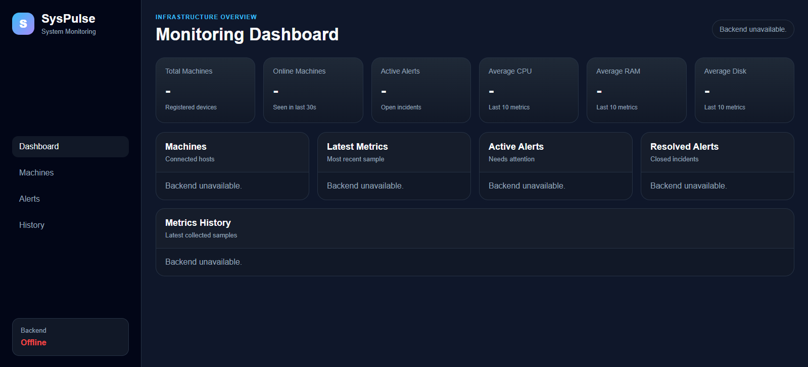

# SysPulse


SysPulse is a system monitoring platform that collects machine metrics through a local Python agent and displays them in a web dashboard.

The project demonstrates backend development, API design, database storage, alert logic, observability concepts, testing, CI, and a simple monitoring dashboard.

## Preview



## How to Try It

### 1. Clone the repository

```bash
git clone https://github.com/SofiiaKalugina/SysPulse.git
cd SysPulse
```

---

### 2. Start the backend

Open a terminal:

```bash
cd backend
python -m venv venv
source venv/Scripts/activate
pip install -r requirements.txt
uvicorn main:app --reload
```

Backend will run at:

```text
http://127.0.0.1:8000
```

API docs:

```text
http://127.0.0.1:8000/docs
```

---

### 3. Start the monitoring agent

Open a second terminal:

```bash
cd agent
python -m venv venv
source venv/Scripts/activate
pip install -r requirements.txt
python main.py
```

The agent will begin collecting and sending system metrics automatically.

---

### 4. Open the dashboard

Open this file in your browser:

```text
dashboard/index.html
```

On Windows, the full local URL may look like:

```text
file:///C:/Users/your-user/Desktop/syspulse/dashboard/index.html
```

You should now see:

- live machine metrics
- CPU/RAM/disk usage
- alerts
- machine status
- metrics history
- alert intelligence summary

## Observability Extensions

SysPulse includes observability-focused extensions that make the project closer to real monitoring and alerting tools:

- **Alert Intelligence** — analyzes alert patterns, active/resolved alerts, noisy machines and common alert types.
- **Incident Summary** — generates a short human-readable summary of the current system state.
- **Prometheus-style Export** — exposes latest metrics in a Prometheus-like text format.

Related writeup:

```text
docs/writeups/grafana-alert-intelligence.md
```

## Features

- Python agent for collecting system metrics
- CPU, RAM, disk, process, network, and uptime monitoring
- FastAPI backend
- SQLite database storage
- Machine tracking by hostname
- Online/offline machine status
- Metrics history
- Alert system for high CPU, RAM, and disk usage
- Auto-resolving alerts
- Alert analytics and noisy machine detection
- Incident summary generation
- Prometheus-style metrics export
- Summary API
- Web dashboard
- Backend API tests with pytest
- GitHub Actions CI

## Architecture

```text
Local Machine
    |
    | Python Agent
    | collects system metrics
    v
FastAPI Backend
    |
    | validates and stores data
    v
SQLite Database
    |
    v
Dashboard / API / Alerts
```

## Tech Stack

### Agent

- Python
- psutil
- requests
- python-dotenv

### Backend

- Python
- FastAPI
- SQLAlchemy
- SQLite
- Pydantic
- pytest
- httpx

### Dashboard

- HTML
- CSS
- JavaScript

### DevOps

- Git
- GitHub
- GitHub Actions

## Project Structure

```text
syspulse/
├── agent/
│   ├── collector.py
│   ├── config.py
│   ├── main.py
│   ├── sender.py
│   ├── requirements.txt
│   └── .env.example
│
├── backend/
│   ├── app/
│   │   ├── models/
│   │   ├── routes/
│   │   ├── schemas/
│   │   ├── services/
│   │   └── database.py
│   ├── tests/
│   ├── main.py
│   └── requirements.txt
│
├── dashboard/
│   ├── index.html
│   ├── styles.css
│   └── app.js
│
├── docs/
│   ├── images/
│   │   └── dashboard-preview.png
│   └── writeups/
│       └── grafana-alert-intelligence.md
│
├── .github/
│   └── workflows/
│       └── backend-tests.yml
│
└── README.md
```

## How It Works

1. The agent runs on a machine and collects system metrics.
2. The agent sends metrics to the backend through HTTP.
3. The backend validates the data and stores it in the database.
4. The backend creates or updates the machine record.
5. The alert system checks CPU, RAM, and disk usage.
6. The dashboard fetches data from the backend and displays machine status, metrics, alerts and history.
7. Alert Intelligence analyzes alert patterns and generates incident context.

## Running the Backend

Open a terminal:

```bash
cd backend
python -m venv venv
source venv/Scripts/activate
pip install -r requirements.txt
uvicorn main:app --reload
```

The backend runs at:

```text
http://127.0.0.1:8000
```

API documentation:

```text
http://127.0.0.1:8000/docs
```

## Running the Agent

Open a second terminal:

```bash
cd agent
python -m venv venv
source venv/Scripts/activate
pip install -r requirements.txt
python main.py
```

The agent collects metrics every few seconds and sends them to the backend.

### Agent Configuration

You can configure the agent with environment variables.

Create a `.env` file inside the `agent/` folder:

```env
BACKEND_URL=http://localhost:8000
SEND_INTERVAL_SECONDS=5
```

Available variables:

- `BACKEND_URL` — backend API URL
- `SEND_INTERVAL_SECONDS` — how often the agent collects and sends metrics

## API Endpoints

### Health

```text
GET /health
```

### Metrics

```text
POST /api/metrics
GET /api/metrics/latest
GET /api/metrics/history
```

### Machines

```text
GET /api/machines
```

### Alerts

```text
GET /api/alerts
```

### Alert Analytics

```text
GET /api/alerts/analytics
```

### Incidents

```text
GET /api/incidents/summary
```

### Export

```text
GET /api/export/prometheus
```

### Summary

```text
GET /api/summary
```

## Prometheus-style Export Example

```text
# HELP syspulse_cpu_percent Current CPU usage percentage.
# TYPE syspulse_cpu_percent gauge
syspulse_cpu_percent{hostname="local-workstation"} 13.5

# HELP syspulse_ram_percent Current RAM usage percentage.
# TYPE syspulse_ram_percent gauge
syspulse_ram_percent{hostname="local-workstation"} 72.9
```

## Alert Rules

Current alert rules:

```text
CPU > 80%  -> high alert
RAM > 85%  -> high alert
Disk > 90% -> critical alert
```

Auto-resolve logic:

```text
CPU < 70%  -> resolve CPU alert
RAM < 75%  -> resolve RAM alert
Disk < 85% -> resolve disk alert
```

## Running Tests

From the backend folder:

```bash
cd backend
source venv/Scripts/activate
pytest
```

Expected result:

```text
10 passed
```

## CI

GitHub Actions runs backend tests automatically on every push and pull request to the main branch.

## Current Status

Implemented:

- Agent metrics collection
- Backend API
- Database storage
- Machines tracking
- Online/offline status
- Metrics history
- Alert system
- Auto-resolve alerts
- Alert analytics
- Incident summary
- Prometheus-style export
- Dashboard
- Summary API
- Backend tests
- GitHub Actions CI

Planned improvements:

- PostgreSQL support
- Docker setup
- Authentication
- CSV export
- Email notifications
- More detailed charts
- OpenTelemetry-compatible export
- Real Grafana dashboard integration